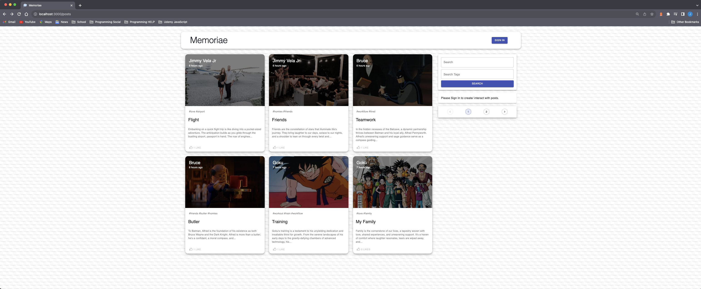
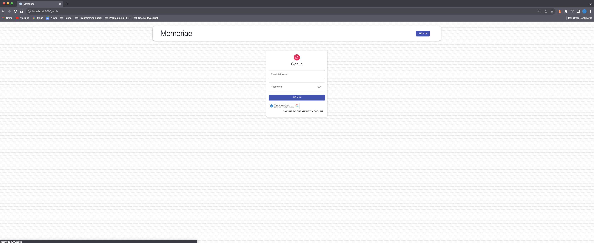
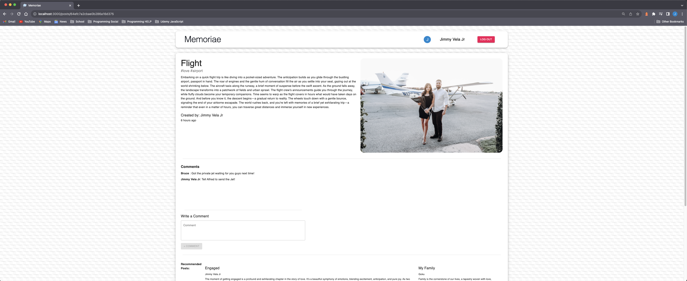

# Memoriae

##  

## **Table of Contents:**

### [Description](#description)

### [Technologies_Used](#technologies_used)

### [User_Story](#user_story)

### [Images](#images)

### [Links](#links)

### [License](#license)

## **Description**

The Memoriae App will allow you to share memories with others. Its a blog application that once a user creates an account they are allowed to post memories and interact with others by commenting and liking others posts. This application utilizes the capabilities of the MERN Fullstack, users will be authenticated by JWT and Google OAuth.

## **Technologies_Used**

- Mongo
- Express
- Node
- JWT
- React
- Material-UI
- Redux
- Google OAuth

## **User_Story**

```
AS A user who wants to be able to share memories with others
I WANT to be able to create and share memories and allow others to interact by liking post and commenting on them.
SO I can share my expiereces.
```


## **Images**





## **Links**

Link to GitHub Repository:
https://github.com/Jimmy-Vela06/memories-project-MERN

Link to Web Page: 
https://memoriae-mern.net

## **License**

MIT License

Copyright (c) 2023 Jimmy Vela Jr

Permission is hereby granted, free of charge, to any person obtaining a copy
of this software and associated documentation files (the "Software"), to deal
in the Software without restriction, including without limitation the rights
to use, copy, modify, merge, publish, distribute, sublicense, and/or sell
copies of the Software, and to permit persons to whom the Software is
furnished to do so, subject to the following conditions:

The above copyright notice and this permission notice shall be included in all
copies or substantial portions of the Software.

THE SOFTWARE IS PROVIDED "AS IS", WITHOUT WARRANTY OF ANY KIND, EXPRESS OR
IMPLIED, INCLUDING BUT NOT LIMITED TO THE WARRANTIES OF MERCHANTABILITY,
FITNESS FOR A PARTICULAR PURPOSE AND NONINFRINGEMENT. IN NO EVENT SHALL THE
AUTHORS OR COPYRIGHT HOLDERS BE LIABLE FOR ANY CLAIM, DAMAGES OR OTHER
LIABILITY, WHETHER IN AN ACTION OF CONTRACT, TORT OR OTHERWISE, ARISING FROM,
OUT OF OR IN CONNECTION WITH THE SOFTWARE OR THE USE OR OTHER DEALINGS IN THE
SOFTWARE.
